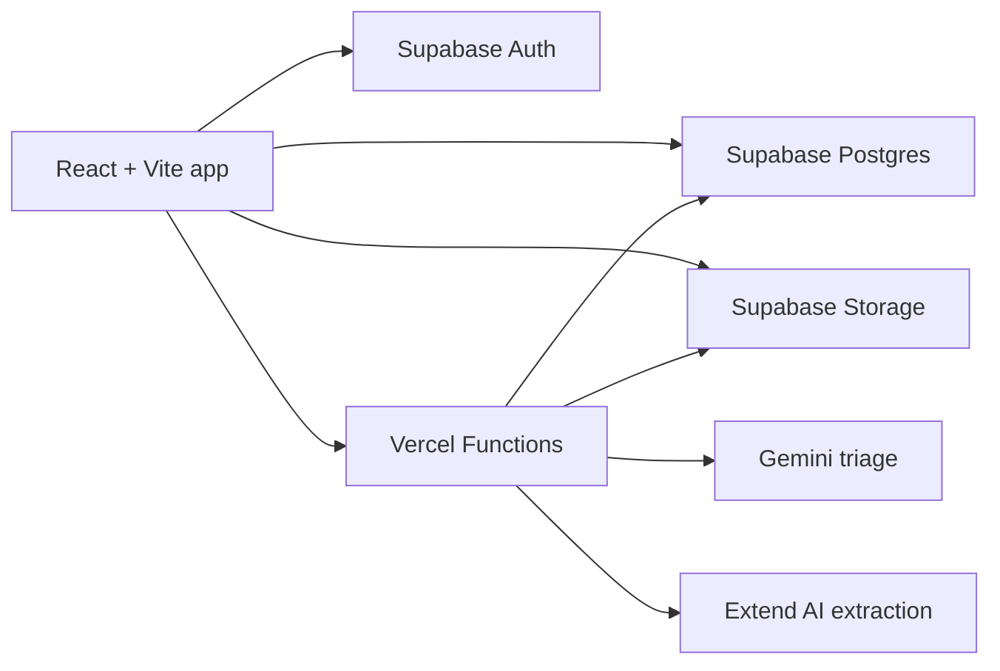

# Sunder

AI document operations for claims teams. Sunder turns messy legal and claims document packets into a reviewable dossier: upload the source files, classify and split them, extract structured evidence with citations, verify the fields against the originals, and generate report-ready outputs.

https://www.trysunder.com

## Why I Built Sunder

Claims review is not hard because one PDF is hard to read. It is hard because the source material arrives as a messy folder: medical bills, medical reports, income documents, duplicate scans, combined PDFs, missing fields, and numbers that need to be defensible.

Most AI document demos stop at extraction. Sunder is built around the next step: giving a human reviewer enough structure, source traceability, and workflow state to trust what happened. The product keeps the original documents visible, turns review policy into a checklist, and treats AI output as evidence to verify rather than magic to accept.

## Quick Start

```bash
npm install
npm run dev
```

For the final demo path, use Vercel Functions rather than plain Vite when document-processing API routes are required:

```bash
VITE_ENABLE_LOCAL_GEMINI_PROCESSING=true vercel dev
```

Private legal and medical PDFs are not committed to this repository. Demo documents live outside git and must be checked for redaction before any recording or live walkthrough.

## Philosophy

Evidence over theater. Sunder should make the review work inspectable: source documents, citations, field values, duplicate flags, processing status, and generated artifacts.

Human in control. AI classifies, splits, extracts, and flags. The reviewer still decides what is accepted, what is missing, and what should be escalated.

Workflow before chat. The core product is a dossier workspace, not a generic assistant shell. Chat and analyst features are useful only when they operate over structured case evidence.

Built for messy inputs. The happy path assumes real-world claim packets: scans, photos, combined PDFs, duplicates, partial uploads, and documents arriving over time.

## What It Supports

Multi-file intake - upload scattered PDFs and images into a case workspace.

Document triage - classify files, write reviewer-friendly descriptions, and track processing status.

PDF splitting - turn combined PDFs into logical review sections instead of treating the whole file as one blob.

Duplicate detection - flag repeated material so reviewers are less likely to double-count evidence.

Structured extraction - extract fields for medical expenses, medical reports, income documents, and configured claim schemas.

Citation review - show extracted values beside the source document so reviewers can verify the evidence.

Rules and validation - surface missing fields, payer classifications, and review issues as checklist-style work.

Report generation - produce downstream claim/report artifacts from reviewed case data.

## Demo Flow

The current walkthrough uses a private seeded legal claim case:

1. Open a clean claim case.
2. Upload a small but realistic batch of redacted source documents.
3. Watch upload, classification, splitting, extraction, and duplicate status.
4. Open a processed document and review extracted fields against citations.
5. Check rules and validation issues.
6. Generate or inspect report artifacts from the case library.

See [DEMO.md](./DEMO.md) for the recording runbook.

## Architecture



The frontend is a React and TanStack workspace backed by Supabase. Vercel Functions coordinate document triage and extraction. Gemini handles classification/splitting work, Extend AI handles structured extraction and citations, and Supabase stores case records, source files, status, and generated artifacts.

## Stack

- React 19 + Vite
- TypeScript
- TanStack Router
- TanStack Query
- TanStack Table
- ShadCN UI + Tailwind CSS
- Supabase Auth, Postgres, and Storage
- Vercel Functions
- Gemini for document triage
- Extend AI for structured extraction and citations

## Key Files

- `src/routes/cases/` - case list, case detail, and document review routes
- `src/components/documents/` - upload, file table, extraction review, viewer, and split panes
- `src/components/docgen/` - report history and generated artifact surfaces
- `src/config/clients/hoh-law.ts` - Hoh Law-style claim review configuration
- `src/clients/hoh-law/` - client-specific schemas and report logic
- `supabase/migrations/` - database schema recovery and portfolio demo migrations
- `DEMO.md` - private demo recording runbook
- `PRODUCT.md` - product principles and design constraints

## Health Checks

```bash
npm run build
npm run test:run
npm run lint
```

Lint currently includes legacy/non-demo debt. Production readiness should prioritize build success, the legal claim demo path, and any lint failures touching upload, extraction review, report generation, auth, Supabase, or Vercel functions.

## Repository Notes

The private product remote is `Sethzy/Sunder`. The public portfolio remote is `Sethzy/sunder-document-processing`.
